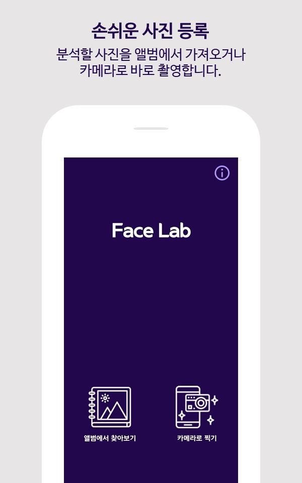
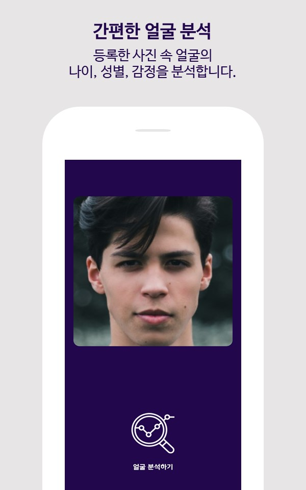
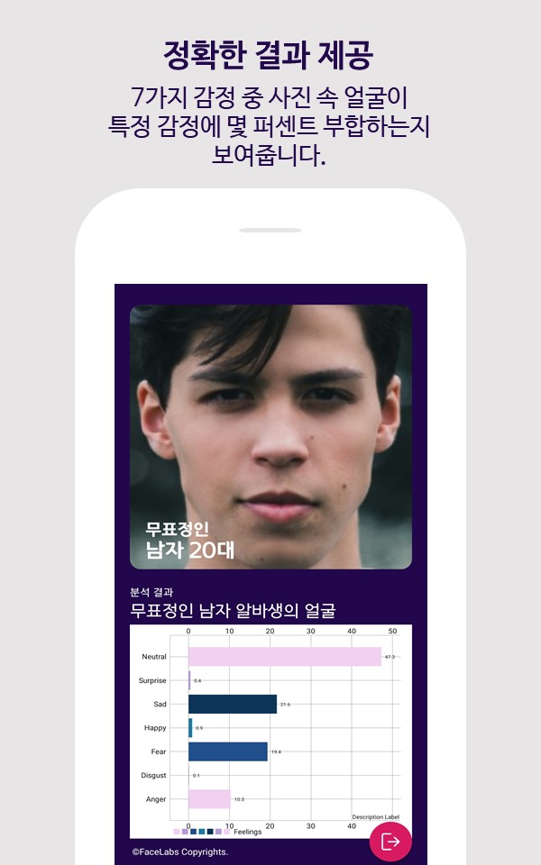

# :mag_right: FaceLab - A simple face analysis application using AI
> 개발 기간 : 2019.06.25 ~ 2019.09.25

This is a simple face analysis application using AI
1. You can use images from an album or take pictures.
2. You can get results from the following list:
- Sex : Male / Female
- Age : baby / children / elementary school student / middle school student / high school student / 20s / 30s / 40s / 50s / over 60s
- Emotion : Anger / Disgust / Fear / Happy / Sad / Surprise / Neutral
3. You can share the results on SNS directly.
4. You can save the results as a picture.

## 🛠️ Stack & Libraries
- Kotlin
- [TensorFlow Lite](https://github.com/tensorflow/tflite-support)
- [MPAndroidChart](https://github.com/PhilJay/MPAndroidChart)
- [TedPermission](https://github.com/ParkSangGwon/TedPermission)
- [android-crop](https://github.com/jdamcd/android-crop)

## :sparkles: Screenshots
 

 

## :gear: Development Environment
- Android Studio - Arctic Fox | 2020.3.1
- minSdkVersion : 21
- targetSdkVersion : 31

## :memo: Release History
- v1.0.0 - 2019.09.20
- v1.1.0 - 2019.09.26
  - NullpointerException 오류 수정
- v1.2.0 - 2021.09.24
  - 이미지 처리 오류 수정
  - 전반적인 UI 개선
  - 리팩토링 (Java > Kotlin migration)
